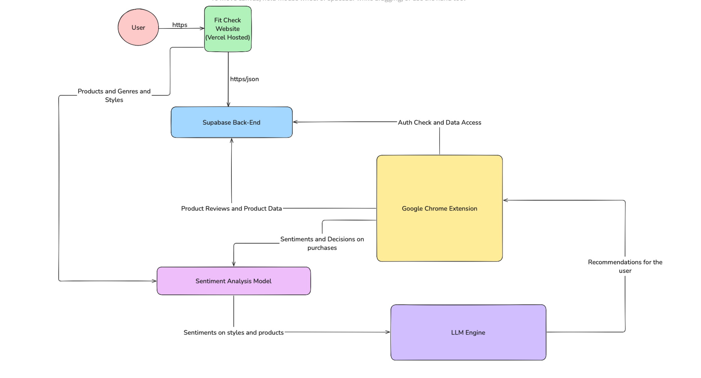

# Assigment 2
1) 

Here once the user installs the Chrome Extension, they will be redirected to our Vercel Hosted webpage where they will be prompted to login/register. Once successfuly, after validation with the Supabase backend, they will be able to scrape order history in Amazon for example and then review the products via Chrome Extension. This information will be in the Supabase Database as well but will also be sent to the Sentiment Analysis Model to give some sentiments of user styles and products. After that, we will use an LLM engine to give recommendations in the Chrome Extension popup.

3) 

